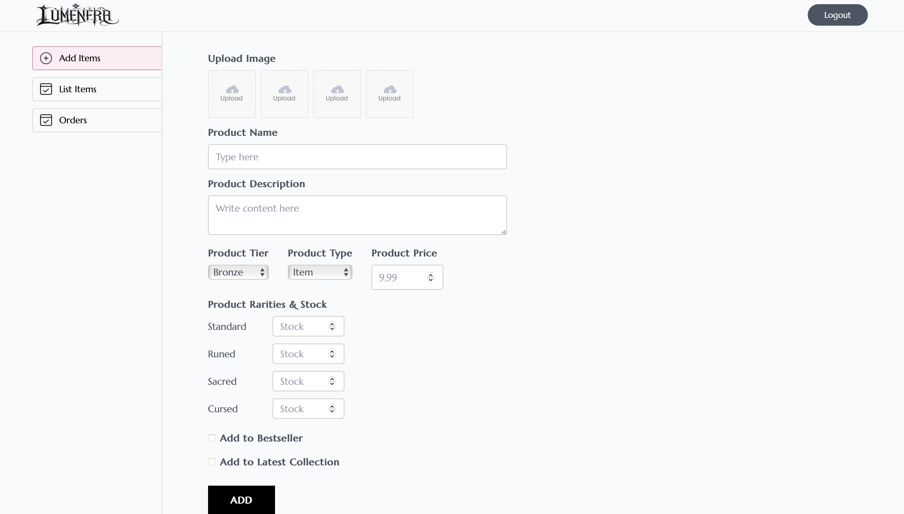
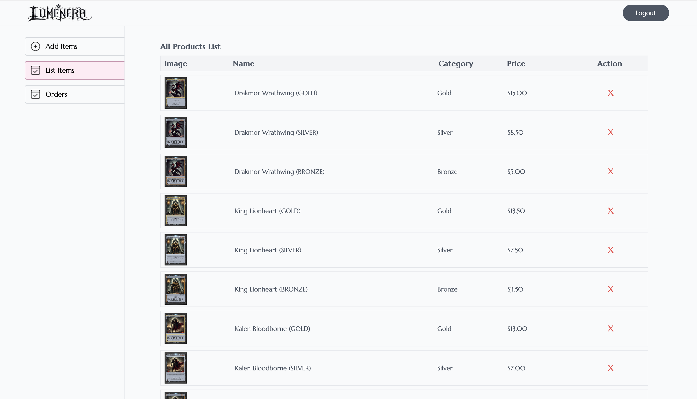
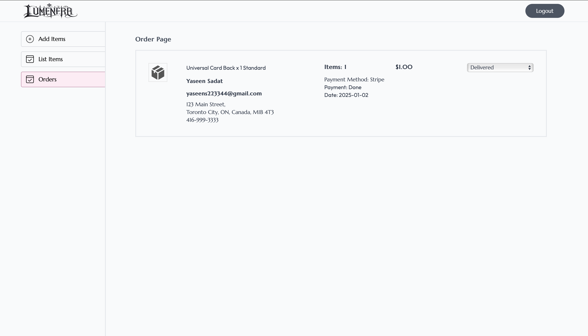

# Lumenera

# Lumenera

**Lumenera** is a Dark Fantasy Trading Card Platform designed to provide an interactive and engaging experience for players and collectors. It includes the following main features:
This project is a full-stack e-commerce system built using the MERN stack, featuring MongoDB for data storage, Express.js and Node.js for backend services, and React with Tailwind CSS for a responsive frontend. It integrates with Stripe for secure payment processing and Cloudinary for dynamic file storage. The platform incorporates robust authentication mechanisms, including JWT token-based authentication, bcrypt for password hashing, and secure password reset functionalities with token validation and expiration. Deployed using Docker with a CI/CD pipeline and hosted on Render, Lumenera ensures scalability, reliability, and seamless updates, enabling users to browse, collect, and trade exclusive trading cards efficiently.

Check out the project: [Lumenera](https://lumenera.onrender.com).

Check out the code on GitHub: [Lumenera](https://github.com/YaseenSadat/Lumenera).

---

## Table of Contents

1. [Creators](#creators)
2. [Summary](#summary)
3. [Features](#features)
4. [Technology](#technology)
5. [Feedback](#feedback)

---
## Creators

The project was founded and developed by:

- [YaseenSadat](https://github.com/YaseenSadat)

---

## Summary

🌟 **What Lumenera Does**  
Lumenera is a groundbreaking platform designed to immerse players and collectors in the captivating world of dark fantasy trading cards. With features that allow users to explore unique cards, manage their collections, and engage in strategic gameplay, Lumenera transforms the art of trading cards into an unforgettable experience. At its core is a commitment to craftsmanship, authenticity, and community, ensuring every card tells a story and sparks the imagination.

🌟 **Why I Built Lumenera**  
Driven by a passion for dark fantasy and the art of card gaming, Lumenera was brought to life by me. The vision behind Lumenera is to create a platform that bridges the gap between creativity and competition, offering collectors and players a space to celebrate their love for trading cards. By blending innovative technology with a rich fantasy narrative, Lumenera fosters a community where players of all levels can connect, strategize, and grow together.

🌟 **Why Lumenera is Unique**  
Unlike conventional trading card platforms, Lumenera offers an exclusive and immersive experience built around our meticulously crafted dark fantasy world. Each card is a work of art, designed with passion and precision to ignite creativity and competition. By prioritizing authenticity and innovation, Lumenera ensures every interaction—whether collecting, trading, or playing—is a journey into a world where imagination knows no bounds. It’s more than a platform; it’s a gateway to stories, strategy, and a thriving community of enthusiasts. 🃏✨

---

## Features

Lumenera is packed with cutting-edge features designed to deliver a seamless and enjoyable card trading and buying experience. Here’s what makes Lumenera truly stand out:

### ✨ Account Management  
Effortlessly create, manage, and secure your account with Lumenera’s robust account management system:  

- **Log In, Sign Up, and Log Out**: Enjoy a seamless and secure user experience powered by **JWT token-based authentication**, ensuring fast and reliable access across devices.  
- **Password Security**: User passwords are protected with **bcrypt hashing**, adding an extra layer of security to your sensitive information.  
- **Reset Password Functionality**: Forgot your password? No problem! Our reset system uses secure, email-based token validation with strict expiration policies, ensuring only authorized users can regain access to their accounts.  
- **Session Persistence**: Stay logged in securely with token-based session management, allowing you to pick up right where you left off without compromising safety.  
- **Admin Access with Enhanced Security**: Administrators have exclusive access to a protected interface designed for managing platform operations, backed by additional authentication layers to ensure complete security.  
- **Error Handling and Feedback**: Built-in validation and error reporting guide users through account actions, reducing frustration and enhancing user confidence.  

### 🏠 Home Page  
The central hub of Lumenera, designed to deliver a seamless and captivating user experience:  

- **Intuitive Navigation**: The layout is thoughtfully crafted to ensure ease of use, enabling users to browse products, access their carts, and manage orders effortlessly with just a few clicks.  
- **Dynamic and Fully Functional**: Every feature on the home page is optimized for smooth performance, providing real-time updates and seamless integration with backend systems for a flawless experience.  
- **Responsive Design**: The home page is fully responsive, ensuring it looks and functions beautifully on all screen sizes—from desktops to tablets and mobile devices—so users can enjoy Lumenera anywhere, anytime.  
- **Dark Fantasy Aesthetic**: Immerse yourself in the rich world of Lumenera with a visually engaging interface that perfectly complements the dark fantasy theme, blending artistry with functionality.  
- **Integrated Features**: From product previews to quick navigation links and live updates on cart and order statuses, the home page serves as the gateway to all the powerful features Lumenera has to offer.  

### 🃏 Product Browsing  
Dive into Lumenera’s extensive collection of meticulously designed trading cards with powerful and intuitive browsing features:  

- **Detailed Product Descriptions**: Each card is showcased with rich details, including **high-quality images, rarity, category, and pricing**, offering users a complete understanding of their selection.  
- **Advanced Filters and Sorting**: Effortlessly refine your search by category, subcategory, price range, or rarity, creating a personalized browsing experience tailored to your preferences.  
- **Smart Search Functionality**: Quickly locate specific cards or collections using our intelligent search bar, which delivers precise and relevant results based on keywords or attributes.  
- **Seamless Cart Management**: Add, update, or remove cards from your cart with ease, ensuring a smooth and hassle-free shopping experience.  
- **Interactive Browsing**: Real-time updates and responsive design ensure that browsing and selecting products feel natural and engaging across all devices.  

### 💳 Secure Checkout  
Experience a seamless and secure payment process designed for convenience and peace of mind:  

- **Stripe Integration**: Payments are processed safely and efficiently through **Stripe**, ensuring industry-standard security for all transactions, including service fee calculations.  
- **Automatic Updates**: Stay informed with real-time updates on order and payment statuses immediately after successful transactions, enhancing transparency and user confidence.  
- **Error Handling and Validation**: Built-in safeguards validate payment details and handle errors gracefully, providing clear feedback to users for a smooth checkout experience.  
- **Responsive Design**: The checkout process is fully optimized for all devices, ensuring a consistent and hassle-free experience whether you’re on a desktop, tablet, or smartphone.  

### 📨 Email Notifications  
Stay connected and informed with Lumenera’s advanced email notification system, powered by **Nodemailer**, offering secure, dynamic, and visually engaging communications:  

- **Subscription Emails**: Instantly receive a thoughtfully crafted welcome email when subscribing through the subscription box. These emails are designed to keep you engaged with the latest updates, exclusive offers, and the vibrant Lumenera community.  
- **Dynamic Purchase Emails**: Experience a new standard in purchase confirmations. Our emails dynamically load product images, descriptions, and detailed order summaries, providing a visually rich and clear overview of your transactions. Every email reflects Lumenera’s commitment to quality, ensuring you feel valued with each purchase.  
- **Encrypted Password Reset Emails**: Reset your password with absolute peace of mind. Our secure system generates encrypted, time-sensitive links, ensuring only authorized users can regain account access. Built-in expiration rules and validation mechanisms offer the highest level of security and reliability.  

### 🛠️ Admin Features  
Empower administrators with a dedicated, secure, and fully-featured admin dashboard designed for seamless platform management:

- **Exclusive Protected Admin Page**: A completely separate, secure section of the platform tailored for administrators, ensuring full control over Lumenera’s operations without compromising user data or platform stability.
- **Comprehensive Product Management**: Add, edit, and delete products effortlessly, including multiple image uploads through **Cloudinary**, with real-time updates that instantly reflect on the user-facing side of the platform.
- **Order Oversight and Updates**: View all user orders with detailed insights and update statuses directly from the admin panel, providing a streamlined way to manage the fulfillment process.
- **Scalable Middleware Integration**: Modularized backend functionality translates complex processes like authentication and file handling into intuitive front-end controls, offering admins a powerful yet easy-to-use interface.
- **Unparalleled Stability and Efficiency**: Built with scalability in mind, the admin panel ensures fast, reliable performance under heavy workloads, keeping operations smooth as the platform grows.
- **User-Friendly Design**: A clean, intuitive layout minimizes the learning curve for administrators, enabling efficient navigation across products, orders, and management tasks.
- **Empowering Admin Control**: The dashboard transforms backend complexities into simple, actionable tools, allowing administrators to focus on enhancing the user experience without worrying about technical hurdles.

**📸 Sneak Peek**  

### 🛡️ Built for Scalability and Security  
Lumenera is engineered with cutting-edge technologies to ensure a robust, scalable, and secure platform capable of growing alongside its user base:  
- **Seamless Docker Integration**: Lumenera leverages **Docker** for containerization, guaranteeing consistent environments across all stages of development, testing, and deployment. This approach minimizes errors, enhances portability, and ensures the platform runs smoothly, no matter where it’s hosted.  
- **CI/CD Pipeline Excellence with Jenkins**: Lumenera utilizes **Jenkins** to power its **CI/CD pipelines**, automating integration tests and deployments. Every code change is subjected to rigorous automated testing, ensuring that new features, patches, and updates are rolled out seamlessly and reliably. Jenkins streamlines the entire development lifecycle, reducing downtime and maintaining high platform reliability.  
- **Powerful Render Hosting**: Deployed on **Render**, Lumenera enjoys high availability and unparalleled scalability. Render’s infrastructure ensures the platform can handle surges in user traffic effortlessly while maintaining optimal performance, providing a consistent and dependable user experience at all times.  
- **Future-Proof Architecture**: The combination of containerization, automated pipelines via Jenkins, and scalable hosting on Render ensures Lumenera remains adaptable and ready to meet evolving user demands and technological advancements.  

### 🎨 Craftsmanship and Authenticity  
- Every card in Lumenera is a masterpiece, meticulously designed to capture the essence of its rich and immersive dark fantasy world. From intricate illustrations to compelling narratives, each card tells a story that sparks imagination and fuels the spirit of competition.  
- Exclusive and unparalleled, Lumenera’s designs are 100% authentic, crafted with passion and precision to captivate collectors and players alike. Holding a Lumenera card isn’t just about gameplay—it’s about experiencing a unique blend of art and storytelling that elevates the trading card experience to an entirely new level.  

---

## Technology

Lumenera is built using a powerful and modern technology stack to ensure efficiency, scalability, and an immersive user experience. Here's a clear breakdown:  

### Languages  
- **JavaScript**: Core programming language for both the frontend and backend, enabling dynamic and interactive features.  

### Frameworks  
- **React**: Drives the responsive and visually engaging frontend.  
- **Node.js**: Handles backend operations and server-side logic.  
- **Express.js**: Simplifies API development and server setup with robust middleware support.  
- **Tailwind CSS**: Ensures responsive, consistent, and aesthetic designs that reflect Lumenera’s dark fantasy theme.
- **Jest**: Provides a comprehensive testing framework for ensuring the reliability and functionality of the application's features through unit and integration tests.
 

### Libraries  
- **react-router-dom**: Powers seamless navigation between pages.  
- **axios**: Facilitates efficient HTTP requests to backend APIs.  
- **react-toastify**: Provides non-intrusive real-time notifications.  

### Tools  
- **Nodemailer**: Sends secure and automated emails for subscriptions, purchases, and password resets.  
- **Stripe**: Processes payments securely, including service fee handling.  
- **JWT (JSON Web Tokens)**: Enables secure token-based authentication for users and admins.  
- **Docker**: Ensures consistent environments and smooth deployments via containerization.  
- **Postman**: Used for testing and validating APIs during development.  
- **bcrypt**: Hashes passwords for robust user security.  
- **multer**: Manages file uploads for seamless product management.  
- **Cloudinary**: Stores and retrieves images dynamically, enhancing product displays.  
- **Cors**: Handles cross-origin requests securely.  
- **validator**: Verifies email formats during user registration to prevent errors.  
- **Nodemon**: Speeds up development by automatically restarting the server on code changes.  
- **Jenkins**: Facilitates continuous integration and deployment by automating integration testing, ensuring code changes are thoroughly tested and do not break existing functionality.
- **Babel**: Transpiles modern JavaScript code into a backward-compatible version, ensuring broad compatibility across different browsers and environments.

### Database  
- **MongoDB**: A NoSQL database used to dynamically manage data for users, products, and orders.  

---

## Feedback

We value your input and encourage you to share your thoughts on **Lumenera**. Your feedback plays a crucial role in helping us enhance the platform and create an even better experience for our community. Here's how you can get involved:

1. **How to Submit Feedback**  
   - Fill out our [Google Form](https://docs.google.com/forms/d/e/1FAIpQLSd9O2L8Q9H9v1dHCoFHbcXWJpzGp9LEwrLj0dZDjzZlCC7LNA/viewform?usp=header). It’s quick, straightforward, and accessible for all users.

2. **What Counts as Valuable Feedback**  
   - Suggestions for new features or improvements that can enrich the platform.  
   - Detailed reports on any bugs or technical issues you encounter while using Lumenera.  
   - Insights on the usability, design, or overall user experience of the platform.  

3. **What to Expect After Submitting Feedback**  
   - Every piece of feedback is carefully reviewed by our dedicated team.  
   - We prioritize fixing critical bugs and actively evaluate feature requests for future updates.  
   - Although we cannot promise implementation of every suggestion, your input is deeply valued and helps shape the future of Lumenera.  

Thank you for contributing to the growth and success of **Lumenera**. Together, we can continue building a platform that delights and inspires players and collectors worldwide!  
